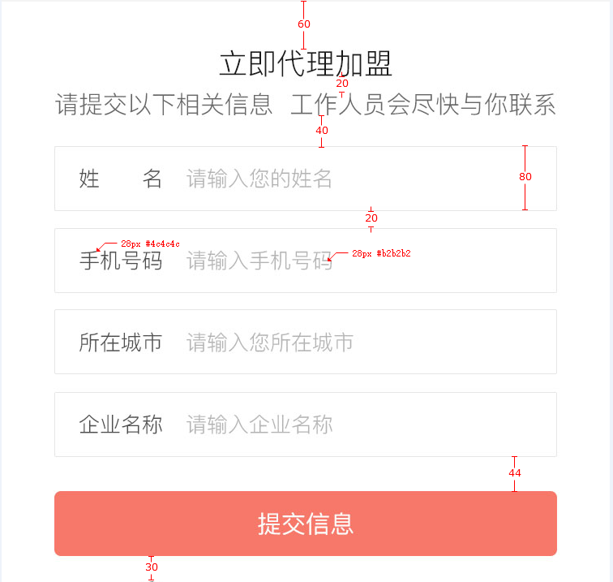
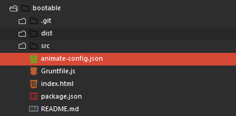

# bootable专注移动端的css框架
## ***安装***
```javascript
1.npm install
或者
cnpm install

2.grunt build
```

## ***1. 继承bootstrap栅栏系统***

>container, container-fluid, row,
>col-xs-\*, col-sm-\*, col-md-\*, col-lg-\*,
>col-xs-offset-\*, col-sm-offset-\*, col-md-offset-\*, col-lg-offset-\*

**如下图所示：**


> *这些都是可以使用的
> 因为是针对移动端的，所以xs用的最多

### **下面这些基本的文本操作和颜色也是可以使用的**

#### 字体排版
>.text-left (居左)
>.text-right (居右)
>.text-center (居中)
>.text-justify (两端对齐)
>.text-nowrap (禁止文字自动换行)

#### 字体大小写
>.text-lowercase (变为全部小写)
>.text-uppercase (变为全部大写)
>.text-capitalize (变为首字母大写)

#### 字体颜色
>.text-muted (#777777)
>.text-primary (#337ab7)
>.text-success (#2b542c)
>.text-info (#31708f)
>.text-warning  (#8a6d3b)
>.text-danger  (#a94442)

#### 背景颜色
>.bg-primary (#337ab7)
>.bg-success (#dff0d8)
>.bg-info (#d9edf7)
>.bg-warning (#fcf8e3)
>.bg-danger (#f2dede)

## ***2. UI设计尺寸和rem的约定***

**UI设计稿按照750像素设计,如下图**



### 字体和尺寸我们的约定是：
- 对于iphone 6s以下的尺寸（device-width在320px~375px之间），统一按照iphone 6s的字体大小和布局高度。
- 对于iphone 6s plus以上的尺寸（device-width:在414px~768px之间），在6s的基础上相应放大。（根据具体需求可以不放大，那么统一html字体改为50px）
- 对于ipad（device-width:在768px以上），还需要再次放大。（根据具体需求可以不放大,同上）
- 字体提供两种单位，rem和px，分别是ft0~ft50(rem)，ftn0~ftn50(px)。针对不同需求和布局时调用。比如文字要跟着布局放大就用rem，文字固定写死的话 用px。

```css
@media only screen and (min-device-width: 319px) {
    html{
        font-size:50px;
    }
}
@media only screen and (min-device-width: 410px) {
    html{
        font-size:70px;
    }
}
@media only screen and (min-device-width: 767px) {
    html{
        font-size:80px;
    }
}
```
### 这样，如上图UI标注:
>40px  在css中按照0.4rem就可以了.
>在iphone6s就是 100%还原。
>在iphone6 plus就会对应放大一些。
>对于这个放大比例，可以在实际项目中调整上面的70px和80px

## ***3. 原子化css类，提高开发效率***
### bootable提供了一系列常用的css类，可以直接应用于元素
>.wc-------------width: 100%
>.hc-------------height: 100%
>.p-rel----------position:relative
>.p-abs----------position:absolute
>.p-stc----------position:static
>.p-fix----------position:fixed
>.ovh------------overflow: hidden
>.dib------------display:inline-block
>.vm-------------vertical-align:middle
>.vt-------------vertical-align:top
>.vtt------------vertical-align:text-top
>.vb-------------vertical-align:bottom
>.vtb------------vertical-align:text-bottom
>.mauto----------margin-left:auto;margin-right:auto
>.dn-------------display:none

### 以下的单位均是转换成rem的，所以UI图标注是多少，这里就是多少。
*如标注left:40px。那么就用 left40*

#### 位置大小
>.left0 ~ .left50-------left:*
>.top0 ~ .top50---------top:*
>.right0 ~ .right50-----right:*
>.bottom0 ~ .bottom50---bottom:*

#### 外边距大小
>.mt0 ~ .mt50 ----------- margin-top:*
>.ml0 ~ .ml50 ----------- margin-left:*
>.mr0 ~ .mr50 -----------margin-right:*
>.mb0 ~ .mb50-----------margin-bottom:*
#### 内边距大小
>.pl0 ~ .pl50-----------padding-left:*
>.pr0 ~ .pr50-----------padding-right:*
>.pt0 ~ .pt50-----------padding-top:*
>.pb0 ~ .pb50-----------padding-bottom:*
#### 宽、高、行高距大小（以 5 为间隔）
>.w0,.w5,.w10 ~ .w250-----width:*
>.h0,.h5,.h10 ~ .h250-----height:*
>.lh0,.lh5 ~ .lh250------line-height:*

*eg:设置一个宽200，高100，上内边距20，左内边距20的div。*

如下图:


```html
<div class="w200 h100 pt20 pl20"></div>
```

## ***4. table-cell布局***
### 移动端弹性布局很多，一行多个并排元素，部分元素定宽，其他元素自动占位。

#### **bootable提供 *div-table*和*div-table-cell*来满足这种布局**
如下图:


*代码如下：*
```html
<div class="div-table">
    <div class="div-table-cell w120 text-right">标题</div>
    <div class="div-table-cell"><input type="text" class="dib wc" /></div>
</div>
```

## ***5. 1px边框的展示***
*由于没有缩放viewport，统一采用1：1*
*所以在drp为2或者3的屏幕中1像素的边框会很粗，我们提供:*
>.scale-1px
>.scale-1px-top,
>.scale-1px-left,
>.scale-1px-right,
>.scale-1px-bottom

## ***6. 整合animate.css***
动画源码来自：https://daneden.github.io/animate.css/
1.按需编译


把需要用到的动画，改为1  再编译

```shell
grunt build
```

然后在需要的html中

```html
<div class="animated jello"></div>
```

ps：这里推荐一个wow.js  配合animate.css 非常好用：[animate.css+wow.js这对好基友](http://www.myjscode.com/page/article23.html)

## ***6. bootable优缺点***

> 优点：简洁高效，从  *bootstrap*  衍生而来。字体与布局采用同一个单位，排版统一。对于大屏幕设备字体支持良好。

>缺点：不支持pc端，没有采用  flex  布局用  table-cell  布局代替，不确定性能。

## ***7. bootable后续***

这里只集成了核心的css，后续会增加很多我们在实际开发者用到的很多插件，比如 **animate.css** 等。
# 敬请期待...